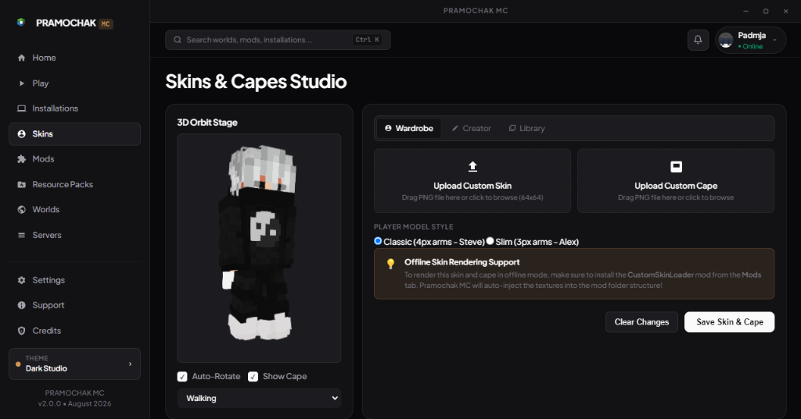
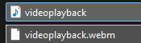
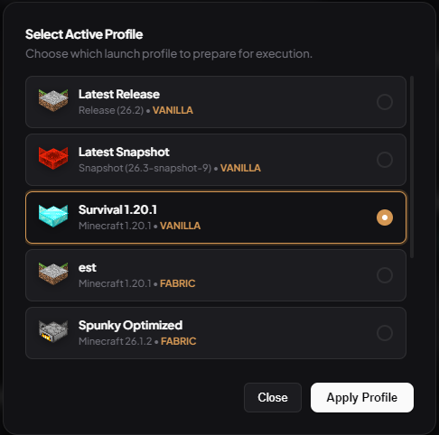
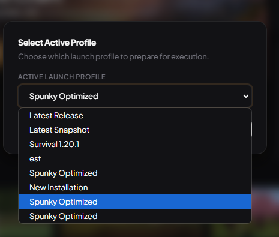
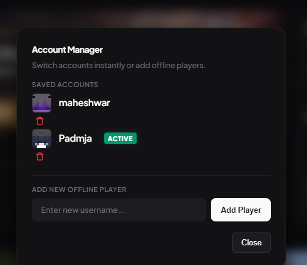



  

  # ⚡ Pramochak MC Launcher
  ### *The Fastest, Lightweight, Next-Generation Minecraft Studio Launcher*

  
  
  
  
  
  

  

    <b>Pramochak MC</b> is an ultra-fast, modern, aesthetic open-source Minecraft launcher engineered with a high-performance <b>Tauri v2 + Rust</b> backend and a luxury <b>Dark Studio UI</b>. Features 1-click Fabric/Forge/Quilt modpack importing, real-time 3D WebGL skin & cape studio, 4-stage visual launch pipeline stepper, isolated world save managers, multiplayer server pinging, and instant game launching.
  

  

    <a href="installers/Pramochak%20MC_1.0.0_x64-setup.exe"><b>📥 Download Windows Setup (.exe)</b></a> • 
    <a href="installers/Pramochak%20MC_1.0.0_x64_en-US.msi"><b>📦 Download MSI Installer (.msi)</b></a> • 
    <a href="#-features-showcase"><b>✨ Feature Showcase</b></a> • 
    <a href="#-architecture--comparison"><b>📊 Comparison Matrix</b></a> • 
    <a href="#-build-from-source"><b>🛠️ Build from Source</b></a>
  

---

## 📸 Features & Showcase

### 1. 🚀 Minimalist Dark Studio Hero Launchpad
*Designed with editorial typography, instant 1-click launch, real-time system telemetry (RAM, Java runtime, storage), and dynamic world screenshot covers.*

  

---

### 2. ⚡ 4-Stage Launch Pipeline Stepper & Live Shimmer Telemetry
*Replaced outdated popup boxes with a benchmark standard modal featuring Active Instance Capsule, 4-stage pipeline indicators ([Assets] → [Libraries] → [Client JAR] → [JVM Engine]), continuous flame shimmer progress, and collapsible monospace debug console.*

  

---

### 3. 🎨 3D WebGL Skin & Cape Wardrobe + 2D Pixel Editor
*Studio-grade 3D skin viewer with live walking animations, cape rendering, Mojang/Ely.by cloud skin fetching, and an integrated 64x64 pixel texture studio.*

  

---

### 4. 🧱 3D Minecraft Block Installation Manager
*Custom installations are automatically assigned distinct solid 3D Minecraft block icons (Grass, Diamond Block, Obsidian, TNT, Bookshelf, Furnace, etc.) with quick folder access and 1-click modpack launching.*

  

---

### 5. 🎬 Dual-Stage Cinematic Boot Sequence
*Frame-locked audio/video intro followed by a minimalist 3.8s matte-black brand sting with glowing emblem and creator watermark.*

  

---

## 🌟 Key Features

- ⚡ **Ultra-Fast Rust Core**: Powered by Tauri v2 and asynchronous Tokio JSON-RPC channels with startup in under 200ms.
- 🚀 **4-Stage Visual Stepper**: Clear visual tracking for Assets, Libraries, Client JAR, and JVM Engine execution.
- 🎨 **Unified 3D Skin & Cape Studio**: Real-time WebGL rendering, HD Capes, and built-in 2D pixel editor.
- 🧱 **3D Block Installations**: 62 solid Minecraft blocks mapped to custom game instances.
- 📸 **Strict World-Isolated Screenshots**: Real in-game screenshots taken during world sessions are automatically filtered and displayed as card covers.
- 🔌 **1-Click Modpack Importer**: Download mods, resource packs, and shaders directly from Modrinth & CurseForge.
- 🌐 **PaperMC / Purpur Server Hosting**: Built-in local server creator with auto RAM allocation and real-time terminal console.
- 🎯 **Privacy & Zero Telemetry Leak**: All paths dynamically resolved with zero personal machine data exposed.

---

## 📊 Architecture & Comparison

| Feature | Pramochak MC ⚡ | Prism Launcher | Modrinth App | Lunar Client | CurseForge |
| :--- | :---: | :---: | :---: | :---: | :---: |
| **Backend Engine** | **Rust + Tauri v2** | C++ (Qt) | Rust + WebView | Java | Electron (Heavy) |
| **RAM Footprint** | **~25 - 40 MB** | ~60 MB | ~110 MB | ~250 MB | ~450 MB+ |
| **3D WebGL Skin & Cape Studio** | ✅ **Built-in** | ❌ | ❌ | Partial | ❌ |
| **2D In-App Pixel Texture Editor** | ✅ **Built-in** | ❌ | ❌ | ❌ | ❌ |
| **4-Stage Visual Launch Stepper** | ✅ **Built-in** | ❌ | ❌ | ❌ | ❌ |
| **Strict World Screenshot Feeds** | ✅ **Real In-Game** | ❌ (Static) | ❌ (Static) | ❌ | ❌ |
| **Local PaperMC Server Host** | ✅ **1-Click** | ❌ | ❌ | ❌ | ❌ |
| **Dark Studio Aesthetics** | ✅ **Linear-Style** | ❌ | Partial | ❌ | ❌ |

---

## 📥 Installation

### Windows Installer (Recommended)
1. Download [Pramochak MC_1.0.0_x64-setup.exe](installers/Pramochak%20MC_1.0.0_x64-setup.exe) or [Pramochak MC_1.0.0_x64_en-US.msi](installers/Pramochak%20MC_1.0.0_x64_en-US.msi).
2. Run the setup wizard to install Pramochak MC to your system.
3. Launch directly from your Desktop shortcut or Start Menu search!

### Portable Version
Download the precompiled portable binary [	auri-launcher.exe](tauri-launcher/src-tauri/target/release/tauri-launcher.exe) and run without installation.

---

## 🛠️ Build from Source

### Prerequisites
- [Node.js](https://nodejs.org/) (v18+)
- [Rust & Cargo](https://www.rust-lang.org/) (v1.75+)
- [Java Runtime Environment](https://adoptium.net/) (Java 8, 17, or 21)

### Steps

`ash
# 1. Clone the repository
git clone https://github.com/maheshwarkibehan-hub/pramochak-mc-launcher.git
cd pramochak-mc-launcher

# 2. Install dependencies
npm install
cd tauri-launcher && npm install && cd ..

# 3. Run in Development Mode (Live Hot-Reload)
npm run tauri:dev

# 4. Build Production Windows PC Installer (.exe & .msi)
npm run tauri:build
`

---

## 🏷️ GitHub Topics & Keywords
minecraft • minecraft-launcher • 	auri • 
ust • electron • abric • orge • quilt • minecraft-modpack • modrinth • curseforge • minecraft-skins • webgl • game-launcher • desktop-app • gaming • minecraft-client • optifine • cross-platform • ramer-motion

---

## 📄 License & Credits
Designed and Developed with ❤️ by **[Maheshwar Hari Tripathi](https://github.com/maheshwarkibehan-hub)**  
Licensed under the **MIT License**. Copyright (c) 2026 **Maheshwar Hari Tripathi**. All rights reserved.  
Repository: [https://github.com/maheshwarkibehan-hub/pramochak-mc-launcher](https://github.com/maheshwarkibehan-hub/pramochak-mc-launcher)
